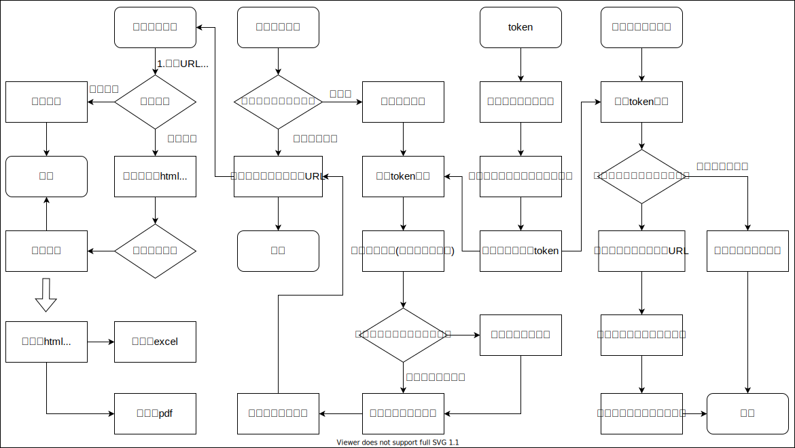
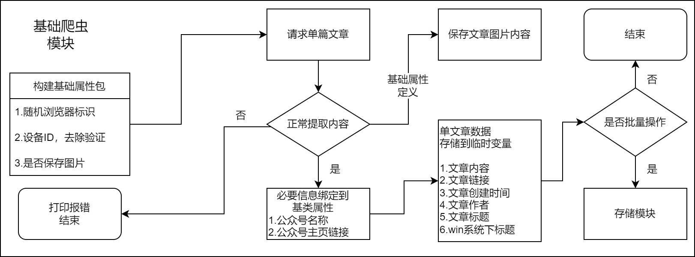
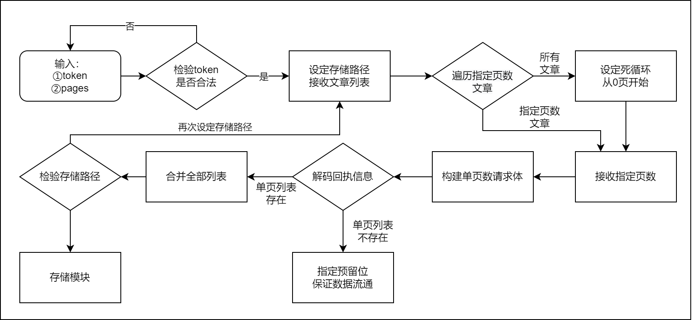
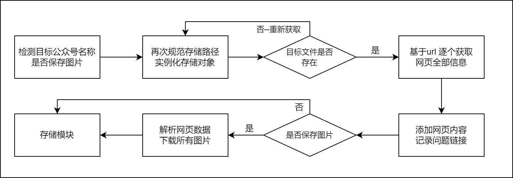
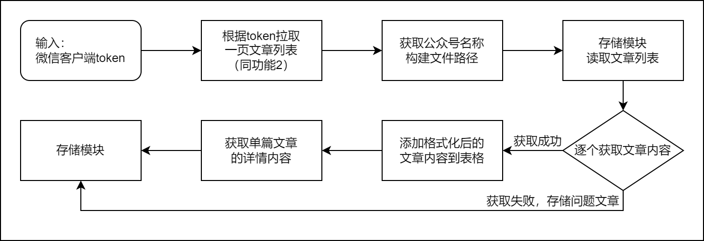

## Access_wechat_article — 微信公众号文章获取与行为数据提取工具

**最近更新**：2026-02-06

**Access_WeChat_Article** 是一种基于Python 的技术工具，用于辅助研究人员系统性地处理微信公众号公开文章及其元数据（如阅读趋势、互动指标等）。该工具强调**可控性、可复现性与科研可用性**，可用于传播学、社会科学、公共舆论、数据挖掘等领域的**学术研究**与**定量分析**。

>  📌 **注意事项**   
>
> 本项目为科研工具，**仅限学术研究、非商业用途**使用。
>
> 项目本身不提供、不存储、也不传播任何受著作权保护的内容。
>
> 使用者必须遵守微信平台服务协议、《网络安全法》及相关法律法规，不得用于侵犯他人著作权、隐私权、商业竞争或其他非法目的。任何违反法律法规的使用行为与本项目无关，使用者自行承担全部法律责任。

---

## 📦 开发指南与贡献方式

本项目支持 Windows / Linux 开箱即用，请 **Fork** 项目后自行研究使用，**建议使用虚拟环境运行项目**。

欢迎对自动化技术、数据结构化方案和性能优化策略进行探讨与改进：

- 提交  [issues](https://github.com/yeximm/Access_wechat_article/issues) 讨论技术细节
- 提交 pull request 优化代码
- 引入自动化测试与 CI/CD 流水线增强项目质量

**注**：请在 [GitHub](https://github.com/) 平台提交 [issues](https://github.com/yeximm/Access_wechat_article/issues)

## 1 适用场景与主要功能

本工具主要服务于以下**科研场景**：

- 长期追踪特定议题/机构的微信传播表现 
- 分析公众号内容生产与受众互动规律
- 研究虚假信息传播、舆论极化、议程设置等传播现象
- 构建微信生态数据集用于机器学习/自然语言处理任务

**主要功能**包括：

- 获取**公众号主页链接**，通过微信内置浏览器可直接打开
- 获取公众号**已发布**的文章列表（**微信公众号**下的历史文章）
- 批量下载公众号文章的**网页文本数据**
- 获取微信公众号文章的**所有信息**，如阅读量、点赞数、转发数、评论、评论点赞等信息

## 2 技术环境及工具

- 操作系统：**Windows 10/11 ×64** 或 **Linux**
- Python 版本：>= 3.13
- 涉及应用：微信**PC版**，当前项目已适配的微信版本：**`4.1.5.16`**
- 使用工具：[Fiddler Classic](https://www.telerik.com/fiddler/fiddler-classic)，当前项目适配的Fiddler Classic版本：**`v5.0.20253.3311`**

**目录架构**

```bash
Access_wechat_article/
├── .venv/             # 虚拟环境目录
├── src/               # 源代码目录 
│   ├── core/          # 核心代码
│   │   ├── base_spider.py     # 基础爬虫模块
│   │   └── wechat_funcs.py    # 微信token模块
│   ├── storage        # 存储代码
│   │   ├── save_to_html.py    # (核心模块)下载页面内容到本地 html
│   │   └── save_to_excel.py   # 转 html 到 excel
│   ├── utils          # 工具代码
│   │   └── tools.py           # 常用工具
│   └── all_process.py # 流程汇总
├── main.py               # 项目主文件
├── requirements.txt      # 项目依赖列表
├── .python-version		  # 添加uv支持
├── pyproject.toml		  # 添加uv支持
├── uv.lock				  # 添加uv支持
├── .gitignore			  # 添加gitignore
├── LICENSE       # 许可凭证
├── README/       # 项目说明文档资源（图片、文件）
└── README.md     # 项目说明文档
```

## 3 程序使用

### 3.1下载 / Download

- 下载地址：[https://github.com/yeximm/Access_wechat_article/releases](https://github.com/yeximm/Access_wechat_article/releases)
  - 👆👆👆以上为本项目发布页地址，选取所需版本下载即可。


- 存储库快照：[Github_master](https://github.com/yeximm/Access_wechat_article/archive/refs/heads/master.zip)
  - 存储库快照等同于 [Releases](https://github.com/yeximm/Access_wechat_article/releases) 中的 [Source Code (zip)](https://github.com/yeximm/Access_wechat_article/archive/refs/heads/master.zip) 等，包含 `README` 等内容

### 3.2 Python环境配置

此处提供原生python虚拟环境的创建流程，uv 安装依赖请使用 [`uv sync`](https://www.runoob.com/python3/uv-tutorial.html)，安装好依赖后请参考 **3.4 Playwright内核**。

（1）创建虚拟环境

```bash
python -m venv .venv
```

`venv`指定存放环境的目录，一般使用 `venv`，这是一个不成文的规定。

（2）**激活**环境

- Windows

  ```bash
  .\.venv\Scripts\activate
  ```

- Unix/macOS

  ```bash
  source .venv/bin/activate
  ```

（3）退出环境

```bash
deactivate
```

### 3.3 安装项目依赖包

`requirements.txt`中包含所需python包文件名称，用来批量安装python包文件

安装命令：

```bash
pip install -r requirements.txt
```

> 注：使用 pip 命令在虚拟环境中安装 python 包时可能会出现 **false 目录**，该目录是 pip 的缓存文件，可直接删除。
>
> 使用 `pip cache dir` 查看 pip 的缓存目录，即：
>
> ```bash
> pip cache dir
> # your_project_dir\access_wechat_article\false
> ```

### 3.4 Playwright内核

使用Playwright提供的浏览器内核进行网页访问。

（1）**激活**环境, 以Windows为例

激活成功后，命令行提示符前会显示 `(.venv)`

```bash
.\.venv\Scripts\activate
```

（2）创建浏览器安装目录，安装在`(.venv)`目录下

```bash
# 使用 Python 创建目录并安装
python -c "import os; os.makedirs('.venv/.playwright-browsers', exist_ok=True)"
```

（3）手动设置环境变量

- **Windows PowerShell**

  - ```bash
    $env:PLAYWRIGHT_BROWSERS_PATH="$PWD\.venv\.playwright-browsers"
    ```

- **Windows CMD**

  - ```bash
    set PLAYWRIGHT_BROWSERS_PATH=%CD%\.venv\.playwright-browsers
    ```

- **Linux/Mac**

  - ```bash
    export PLAYWRIGHT_BROWSERS_PATH="$(pwd)/.venv/.playwright-browsers"
    ```

（4）**安装 chromium 内核**

```bash
playwright install chromium
```

**注：** 项目已配置自动使用本地浏览器路径（在 `src/all_process.py` 中）

（5）查看安装结果

打开`.venv\.playwright-browsers`目录，查看目录名称中是否包含 `chromium`

（6）**卸载步骤**（安装错误时使用）

如果需要卸载Playwright浏览器内核，请先**手动设置环境变量**

这里以 Windows PowerShell 为例，运行：

```bash
# 进入虚拟环境
.\.venv\Scripts\activate

# 手动设置环境变量
$env:PLAYWRIGHT_BROWSERS_PATH="$PWD\.venv\.playwright-browsers"

# 卸载所有浏览器
playwright uninstall
```

### 3.5 运行参数

1. 项目主文件为：`main.py`，其功能调用方式详见于此。
   项目中**生成文件的存储路径**为：`./all_data`（该目录由程序**自动创建**）
2. 运行命令：
   
   1. 首先进入**虚拟环境**（详见**激活**虚拟环境）
   
   2. 安装python包文件（如已安装则进行下一步）
   
   3. 在项目目录运行：
   
      - ```bash
        python main.py
        ```
   
   4. 根据控制台提示输入
   
   5. 如需**自定义功能**，参照`main.py`中的函数调用方式自行编写。

## 4 功能示例

### 4.1 功能1

```bash
欢迎使用, 请输入数字键！
        数字键1: 获取公众号主页链接
        数字键2: 获取公众号已发布的文章列表
        数字键3: 下载公众号文章内容 (默认下载 "文章列表" 中的所有文章)
        数字键4: 同功能3, 另外获取每篇文章的 "阅读量"、"点赞数"等信息
                 (请注意请求间隔，若请求太多太快可能会触发封禁!!)
        输入其他任意字符退出!
请输入功能数字: 1
```

**程序执行结果**

```bash
########## 请输入公众号下任意一篇已发布的文章链接。##########
请输入文章链接：https://mp.weixin.qq.com/s/ZNXDr2ErJno9-NdS4RYDCg
为预防被封禁, 短延时：0.906秒
正常获取到文章内容
当前文章为>>>> 法国总统马克龙抵达北京开始访华
公众号名称：新华网
公众号主页: https://mp.weixin.qq.com/mp/profile_ext?action=home&__biz=MzA4MjQxNjQzMA==&scene=124#wechat_redirect
将此链接 （￣︶￣）↗ ↗ ↗ ↗ 粘贴发送到 "微信PC端-文件传输助手"
按回车键继续...
```

### 4.2 功能2

```bash
请输入数字键！
        数字键1: 获取公众号主页链接
        数字键2: 获取公众号已发布的文章列表
        数字键3: 下载公众号文章内容 (默认下载 "文章列表" 中的所有文章)
        数字键4: 同功能3, 另外获取每篇文章的 "阅读量"、"点赞数"等信息
                 (请注意请求间隔，若请求太多太快可能会触发封禁!!)
        输入其他任意字符退出!
请输入功能数字: 2
```

**输入参数**

```bash
########## 以下内容需要用到fiddler工具 ##########
 (1) 在微信客户端打开步骤1获取到的链接,
 (2) 在fiddler中查看——主机地址为https://mp.weixin.qq.com, URL地址为: /mp/profile_ext?acti
 (3) 选中此项后按快捷键: Ctrl+U 复制该网址到剪贴板, 将内容粘贴到此处
请输入复制的链接(づ￣ 3￣)づ：https://mp.weixin.qq.com/mp/profile_ext?xxxxxx...
```

```bash
########## 获取指定页数的文章列表 ##########
一页文章数量约 15 篇, 请根据实际情况估算 (即: input * 15 = 文章数量)
例如: 获取前3页的文章列表, 请输入 3
      公众号下全部文章列表, 请输入: 0  (注意: 若输入0, 全部列表可能需要较长时间, 视文章数量而定)
      公众号下第2页到第5页的文章列表, 请输入 2-5
请输入需要下载的页数(默认: 1): 2-5
```

**程序执行结果**

```bash
参数齐全，开始获取文章信息，默认状态获取全部文章
获取 2 至 5 页的文章列表
正在获取第 2 页文章列表
该页包含 15 篇文章
为预防被封禁,开始延时操作，延时时间：4.962秒
正在获取第 3 页文章列表
该页包含 13 篇文章
为预防被封禁,开始延时操作，延时时间：3.599秒
正在获取第 4 页文章列表
该页包含 14 篇文章
为预防被封禁,开始延时操作，延时时间：6.705秒
正在获取第 5 页文章列表
该页包含 12 篇文章
为预防被封禁,开始延时操作，延时时间：3.075秒
已检测到公众号名称: 新华网

2025-12-03 17:37:16 存储路径>>>> all_data\公众号----新华网\文章列表 (article_list).xlsx
文章列表保存成功
按回车键继续...
```

### 4.3 功能3

默认下载网页所有内容存储为 `html` 形式！

```bash
请输入数字键！
        数字键1: 获取公众号主页链接
        数字键2: 获取公众号已发布的文章列表
        数字键3: 下载公众号文章内容 (默认下载 "文章列表" 中的所有文章)
        数字键4: 同功能3, 另外获取每篇文章的 "阅读量"、"点赞数"等信息
                 (请注意请求间隔，若请求太多太快可能会触发封禁!!)
        输入其他任意字符退出!
请输入功能数字: 3
```

**输入参数**

```bash
########## 保存公众号文章内容 ##########
输入: 已下载文章列表的公众号名称 (例如: 研招网资讯) 或 公众号的一篇文章链接
(若当前会话已执行过步骤2, 可按回车跳过)
请输入: 新华网
```

**程序执行结果**

```bash
为预防被封禁, 短延时：1.043秒
正常获取到文章内容
当前文章为>>>> “时速能破150公里”？这种“爆改”太吓人！
为预防被封禁, 短延时：0.988秒
正常获取到文章内容
当前文章为>>>> 流感季，发烧了怎么办？
...
正常获取到文章内容
当前文章为>>>> 武装袭击事件，中国公民3死1伤！我使馆紧急提醒→
2025-12-03 17:40:43 存储路径>>>> all_data\公众号----新华网\文章内容 (article_contents).xlsx
2025-12-03 17:40:43 存储路径>>>> all_data\公众号----新华网\问题链接 (error_links).xlsx
按回车键继续...
```

### 4.4 功能4

```bash
请输入数字键！
        数字键1: 获取公众号主页链接
        数字键2: 获取公众号已发布的文章列表
        数字键3: 下载公众号文章内容 (默认下载 "文章列表" 中的所有文章)
        数字键4: 同功能3, 另外获取每篇文章的 "阅读量"、"点赞数"等信息
                 (请注意请求间隔，若请求太多太快可能会触发封禁!!)
        输入其他任意字符退出!
请输入功能数字: 4
```

**输入参数**

```bash
########## 保存公众号文章详情 ##########
以下内容需要用到fiddler工具, 参考步骤2将 URL地址 粘贴到此处
请输入复制的链接(づ￣ 3￣)づ: https://mp.weixin.qq.com/mp/profile_ext?xxxxxx...
```

**程序执行结果**

```bash
参数齐全，开始获取文章信息，默认状态获取全部文章
获取 1 至 1 页的文章列表
正在获取第 1 页文章列表
该页包含 13 篇文章
为预防被封禁,开始延时操作，延时时间：5.049秒
为预防被封禁, 短延时：0.148秒
正常获取到文章内容
当前文章为>>>> 湖南省人大常委会原党组成员、副主任叶红专被查
为预防被封禁, 短延时：0.702秒
...
正常获取到文章内容
当前文章为>>>> 武装袭击事件，中国公民3死1伤！我使馆紧急提醒→
为预防被封禁,开始延时操作，延时时间：5.352秒
2025-12-03 17:48:43请求完成, 文章标题为: 武装袭击事件，中国公民3死1伤！我使馆紧急提醒→
2025-12-03 17:48:44 存储路径>>>> all_data\公众号----新华网\文章详情 (article_detiles).xlsx
2025-12-03 17:48:44 存储路径>>>> all_data\公众号----新华网\问题链接 (error_links).xlsx
按回车键继续...
```

## 5 鼓励一下

开源不易，若此项目有帮到你，望你能动用你的发财小手**Star**☆一下。

如有遇到代码方面的问题，欢迎一起讨论，你的鼓励是这个项目继续更新的最大动力！

<p align = "center">    

</p>


另外，十分感谢大家对于本项目的关注。

[](https://github.com/yeximm/Access_wechat_article/stargazers)
[](https://github.com/yeximm/Access_wechat_article/network/members)

## 6 程序流程图



### 6.1 基础爬虫模块



### 6.2 获取文章列表模块（需token）



### 6.3 文章内容获取



### 6.4 文章详细信息获取（需token）



## LICENSE

本作品采用许可协议 <a rel="license" href="http://creativecommons.org/licenses/by-nc-sa/4.0/">Creative Commons Attribution-NonCommercial-ShareAlike 4.0 International</a> ,简称 **[CC BY-NC-SA 4.0](http://creativecommons.org/licenses/by-nc-sa/4.0/)**。

所有以任何方式查看本仓库内容的人、或直接或间接使用本仓库内容的使用者都应仔细阅读此声明。本仓库管理者保留随时更改或补充此免责声明的权利。一旦使用、复制、修改了本仓库内容，则视为您已接受此免责声明。

项目内容仅供学习研究，请勿用于商业用途。如对本仓库内容的功能有需求，应自行开发相关功能。所有基于本仓库内容的源代码，进行的任何修改，为其他个人或组织的自发行为，与本仓库内容没有任何直接或间接的关系，所造成的一切后果亦与本仓库内容和本仓库管理者无关。

本仓库内容中涉及的第三方硬件、软件等，与本仓库内容没有任何直接或间接的关系。本仓库内容仅对部署和使用过程进行客观描述，不代表支持使用任何第三方硬件、软件。使用任何第三方硬件、软件，所造成的一切后果由使用的个人或组织承担，与本仓库内容无关。

## Star History

[](https://www.star-history.com/#yeximm/Access_wechat_article&Date)

